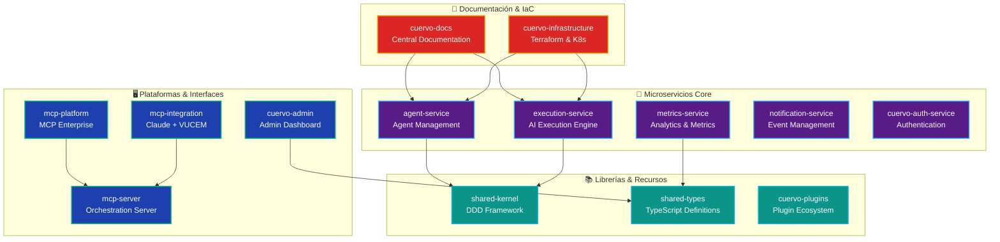

<div align="center">


# CUERVO.AI Organization

## Control Unificado de Recursos y Validación de Orquestación

<div style="margin: 24px 0; display: flex; flex-wrap: wrap; justify-content: center; gap: 8px;">

[](https://github.com/cuervo-ai)
[](https://github.com/orgs/cuervo-ai/repositories)
[](https://opensource.org/licenses/MIT)
[](https://github.com/cuervo-ai)

</div>

**Plataforma Empresarial de Orquestación de Agentes IA para Automatización de Procesos Complejos**

<div style="margin: 20px 0; font-family: 'Inter', -apple-system, BlinkMacSystemFont, sans-serif;">

[**📚 Documentación**](https://github.com/cuervo-ai/cuervo-docs) • [**🏗️ Infraestructura**](https://github.com/cuervo-ai/cuervo-infrastructure) • [**🚀 Microservicios**](#-microservicios) • [**🔍 Explorar Repositorios**](#-repositorios-de-la-organizaci%C3%B3n)

</div>

</div>

---

## 🌟 Visión de la Organización

**CUERVO.AI** es una organización dedicada al desarrollo de tecnología avanzada de orquestación de agentes de inteligencia artificial. Nuestra plataforma implementa principios neurocientíficos inspirados en la arquitectura cerebral corvida para crear sistemas distribuidos de alta eficiencia que automatizan procesos empresariales complejos.

<div style="background: linear-gradient(145deg, rgba(30, 41, 59, 0.95), rgba(15, 23, 42, 0.98)); backdrop-filter: blur(20px); border: 1px solid rgba(14, 165, 233, 0.15); border-radius: 12px; padding: 24px; margin: 24px 0;">

### 🎯 Nuestra Misión

Transformar la complejidad empresarial en inteligencia orquestada mediante sistemas distribuidos que combinan la eficiencia energética de los cerebros corvidos con la potencia computacional moderna.

### 📈 Estado Actual

**Fase:** Consolidación y Escalamiento  
**Arquitectura:** 14 repositorios independientes  
**Stack:** TypeScript, Node.js, React, Kubernetes  
**Enfoque:** Microservicios distribuidos con DDD

</div>

## 🏗️ Arquitectura de la Organización

### Diagrama de Repositorios



## 📦 Repositorios de la Organización

### 🚀 Microservicios

<table width="100%">
<tr>
<td width="50%">

**[agent-service](https://github.com/cuervo-ai/agent-service)**  
🤖 Gestión del ciclo de vida de agentes IA  
*TypeScript • NestJS • DDD*

**[execution-service](https://github.com/cuervo-ai/execution-service)**  
⚡ Motor de ejecución con múltiples proveedores IA  
*Multi-Provider • Streaming • Queue*

**[metrics-service](https://github.com/cuervo-ai/metrics-service)**  
📊 Análisis en tiempo real y métricas  
*TimeSeries • Prometheus • Grafana*

</td>
<td width="50%">

**[notification-service](https://github.com/cuervo-ai/notification-service)**  
📢 Gestión de eventos y notificaciones  
*WebSocket • SSE • Email*

**[cuervo-auth-service](https://github.com/cuervo-ai/cuervo-auth-service)**  
🔐 Autenticación y autorización enterprise  
*JWT • RBAC • Security*

</td>
</tr>
</table>

### 🖥️ Plataformas & Interfaces

<table width="100%">
<tr>
<td width="50%">

**[cuervo-admin](https://github.com/cuervo-ai/cuervo-admin)**  
🎛️ Panel de administración y control  
*React • TypeScript • TailwindCSS*

**[mcp-platform](https://github.com/cuervo-ai/mcp-platform)**  
🏢 Plataforma empresarial MCP  
*Enterprise • Multi-Context • Orchestration*

</td>
<td width="50%">

**[mcp-server](https://github.com/cuervo-ai/mcp-server)**  
🎼 Servidor de orquestación principal  
*GraphQL • WebSocket • Consensus*

**[mcp-integration](https://github.com/cuervo-ai/mcp-integration)**  
🔗 Integración Claude Code + VUCEM  
*Claude • VUCEM • Automation*

</td>
</tr>
</table>

### 📚 Librerías & Recursos

<table width="100%">
<tr>
<td width="33%">

**[shared-kernel](https://github.com/cuervo-ai/shared-kernel)**  
🧠 Núcleo compartido DDD  
*Domain • Events • ValueObjects*

</td>
<td width="33%">

**[shared-types](https://github.com/cuervo-ai/shared-types)**  
📝 Definiciones TypeScript  
*Types • Interfaces • DTOs*

</td>
<td width="33%">

**[cuervo-plugins](https://github.com/cuervo-ai/cuervo-plugins)**  
🔌 Ecosistema de plugins  
*VUCEM • Finance • Healthcare*

</td>
</tr>
</table>

### 📖 Documentación & Infraestructura

<table width="100%">
<tr>
<td width="50%">

**[cuervo-docs](https://github.com/cuervo-ai/cuervo-docs)**  
📚 Hub central de documentación  
*Architecture • Deployment • Runbooks*

</td>
<td width="50%">

**[cuervo-infrastructure](https://github.com/cuervo-ai/cuervo-infrastructure)**  
🏗️ Infraestructura como código  
*Terraform • Kubernetes • Scripts*

</td>
</tr>
</table>

## 🔬 Fundamentos Técnicos

### Arquitectura Cognitiva Corvida

Nuestra plataforma se basa en investigaciones neurocientíficas sobre la excepcional capacidad cognitiva de los córvidos, traduciendo estos principios biológicos en ventajas computacionales:

<div style="background: rgba(30, 41, 59, 0.7); backdrop-filter: blur(20px); border-left: 4px solid #0ea5e9; padding: 20px; margin: 20px 0; border-radius: 8px;">

**🧠 Motor de Inteligencia Distribuida Corvida (CIDE)**
- Densidad neural optimizada con ratio 9:1
- NCL computacional para control ejecutivo
- Procesamiento distribuido pallial
- Aprendizaje adaptativo en tiempo real

**📈 Mejoras Medibles**
- 10-100x eficiencia energética vs arquitecturas tradicionales
- Escalabilidad lineal hasta 1M+ nodos
- 2-5x rendimiento en razonamiento complejo
- 40-60% convergencia más rápida en consenso

</div>

### Stack Tecnológico Unificado

<div style="display: grid; grid-template-columns: repeat(auto-fit, minmax(250px, 1fr)); gap: 16px; margin: 24px 0;">

<div style="background: linear-gradient(145deg, rgba(30, 41, 59, 0.9), rgba(30, 41, 59, 0.7)); border: 1px solid rgba(14, 165, 233, 0.15); border-radius: 8px; padding: 16px;">

**Backend**
- TypeScript 5.3+ / Node.js 20+
- NestJS / Fastify
- PostgreSQL 15 + pgvector
- Redis 7 + WebSocket

</div>

<div style="background: linear-gradient(145deg, rgba(30, 41, 59, 0.9), rgba(30, 41, 59, 0.7)); border: 1px solid rgba(13, 148, 136, 0.15); border-radius: 8px; padding: 16px;">

**Frontend**
- React 18+ / TypeScript
- Vite 5 / TailwindCSS
- Zustand + React Query
- Monaco Editor

</div>

<div style="background: linear-gradient(145deg, rgba(30, 41, 59, 0.9), rgba(30, 41, 59, 0.7)); border: 1px solid rgba(6, 182, 212, 0.15); border-radius: 8px; padding: 16px;">

**Infraestructura**
- Docker + Kubernetes
- Terraform + AWS
- GitHub Actions
- Prometheus + Grafana

</div>

<div style="background: linear-gradient(145deg, rgba(30, 41, 59, 0.9), rgba(30, 41, 59, 0.7)); border: 1px solid rgba(88, 28, 135, 0.15); border-radius: 8px; padding: 16px;">

**AI & ML**
- Multi-Provider (OpenAI, Anthropic, Cohere)
- Constitutional AI Framework
- Vector Search + Semantic
- Streaming + Real-time

</div>

</div>

## 🎯 Capacidades Principales

### 🔄 Orquestación Multi-Agente
- Multi-Context Protocol (MCP) para coordinación distribuida
- Motor de consenso con algoritmos bizantinos
- Enrutamiento contextual basado en análisis semántico
- Métricas en tiempo real con latencia sub-segundo

### 🛡️ IA Constitucional & Governance
- Framework de IA constitucional con principios configurables
- Sistema de transparencia con trazabilidad completa
- Motor de restricciones para cumplimiento normativo
- Dashboard de compliance con alertas automáticas

### ⚡ Procesamiento Inteligente
- Interfaz conversacional con memoria contextual
- Ingesta multi-formato (PDF, DOCX, JSON, XML, CSV)
- Búsqueda semántica híbrida con MeiliSearch y pgvector
- Procesamiento en tiempo real y batch paralelo

## 🚀 Casos de Uso de Referencia

<table width="100%">
<tr>
<th align="left">Dominio</th>
<th align="left">Aplicación</th>
<th align="left">Capacidades</th>
</tr>
<tr>
<td><strong>Comercio Internacional</strong></td>
<td>Gestión aduanera y compliance</td>
<td>Validación de documentos, cálculo de aranceles, tracking</td>
</tr>
<tr>
<td><strong>Salud Digital</strong></td>
<td>Gestión hospitalaria inteligente</td>
<td>Historia clínica, diagnóstico asistido, gestión de citas</td>
</tr>
<tr>
<td><strong>Servicios Financieros</strong></td>
<td>Compliance y análisis de riesgo</td>
<td>KYC/AML automatizado, scoring, detección de fraude</td>
</tr>
<tr>
<td><strong>Cadena de Suministro</strong></td>
<td>Optimización logística</td>
<td>Ruteo inteligente, inventarios, predicción de demanda</td>
</tr>
</table>

## 📊 Métricas de Rendimiento

<div style="background: linear-gradient(145deg, rgba(30, 41, 59, 0.9), rgba(15, 23, 42, 0.95)); border-radius: 12px; padding: 24px; margin: 24px 0;">

### Benchmarks de Producción
- **Latencia P95:** < 100ms para operaciones síncronas
- **Throughput:** 10,000+ req/s por nodo
- **Concurrencia:** 50,000+ conexiones WebSocket
- **Disponibilidad:** 99.9% SLA con auto-recovery
- **MTTR:** < 5 minutos

</div>

## 🛡️ Seguridad & Compliance

### Modelo de Seguridad
- **Autenticación:** JWT con refresh tokens
- **Autorización:** RBAC con políticas granulares
- **Encriptación:** TLS 1.3 + AES-256 en reposo
- **Auditoría:** Logging inmutable con blockchain opcional
- **Compliance:** GDPR, SOC2, ISO 27001 ready

## 🌐 Roadmap Organizacional

<div style="background: rgba(88, 28, 135, 0.05); border-left: 4px solid #581c87; padding: 20px; margin: 20px 0; border-radius: 8px;">

### Q1 2025
- ✅ Consolidación de repositorios independientes
- ✅ Arquitectura de microservicios completada
- 🔄 Sistema de plugins production-ready

### Q2 2025
- 🔄 SDK para desarrolladores externos
- 📦 Marketplace de plugins enterprise
- 🚀 Versión 1.0 estable

### Q3 2025
- ☁️ Escalamiento horizontal automático
- 🌍 Soporte multi-cloud nativo
- 🔒 Certificaciones de seguridad

### Q4 2025
- 🤖 IA generativa integrada nativamente
- 🏢 Expansión de casos de uso empresariales
- 🌐 Disponibilidad internacional

</div>

## 👥 Para Desarrolladores

### 🚀 Quick Start
```bash
# Explorar repositorios
gh repo list cuervo-ai

# Clonar documentación
gh repo clone cuervo-ai/cuervo-docs

# Clonar infraestructura
gh repo clone cuervo-ai/cuervo-infrastructure
```

### 📖 Enlaces Útiles
- **[📚 Documentación Central](https://github.com/cuervo-ai/cuervo-docs)** - Arquitectura, guías de despliegue, runbooks
- **[🏗️ Infraestructura](https://github.com/cuervo-ai/cuervo-infrastructure)** - Terraform, Kubernetes, scripts de automatización
- **[📊 Estado de Migración](https://github.com/cuervo-ai/cuervo-docs/blob/main/migration/REPOSITORY_STATUS_REPORT.md)** - Reporte completo de repositorios

### 🤝 Contribución
Cada repositorio mantiene sus propias guías de contribución. Principios generales:
- Conventional Commits
- TDD con cobertura mínima 80%
- Code Review por maintainers
- Documentación obligatoria (JSDoc/TSDoc)

---

<div align="center" style="margin-top: 48px; padding: 24px; background: linear-gradient(135deg, rgba(88, 28, 135, 0.05), rgba(14, 165, 233, 0.05)); border-radius: 12px;">

**CUERVO.AI** - Transformando la complejidad empresarial en inteligencia orquestada

*Organización privada dedicada al desarrollo de tecnología avanzada de IA*

<small>Copyright © 2025 CUERVO.AI Organization. Todos los derechos reservados.</small>

</div>